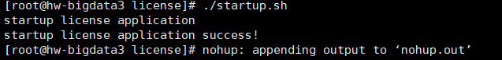

# License-Server使用指南

## 简述

对于我们部署在客户服务器上的软件产品，不希望被客户二次**拷贝**，然后在其他服务器再次部署使用。对于**试用**软件产品的客户，希望在试用期过后就不能继续使用，这时候License-Server就能派上用场了。

License-Server的功能包括设定有效期，绑定机器ip、mac地址、序列号等，授权方直接生成一个license给使用方使用，如果需要增加机器，延长试用期，也只要重新生成一份license即可，无需手动修改软件产品源代码。

## 授权原理

1. 根据每个软件产品或者产品模块生成密钥对，包括公钥及私钥。
2. 授权者保留私钥，并使用私钥根据授权服务器的信息如：失效时间，ip地址，mac地址，序列号等内容加密生成license许可证。
3. 公钥给使用者，放与软件产品目录下使用，用于验证license许可证是否符合条件，不符合条件的软件产品不能运行，过期产品不能访问。

**PS：需要JDK1.8环境**

## 使用KeyTool生成密钥对

### KeyTool介绍

KeyTool是java用于管理密钥和证书的工具，其功能包括：

- 创建并管理密钥
- 创建并管理证书
- 作为CA为证书授权
- 导入导出证书
- ...

KeyTool将密钥和证书存在一个称为keystore文件中，在keystore里包括两种数据：密钥实体和密钥或者私钥和配对公钥（采用非对称加密），可信任的证书实体只包含公钥。

### 使用步骤

#### 生成密钥

使用`win+r`快捷键，输入`cmd`命令，打开命令窗口执行，注意执行目录，最后生成的密钥对在执行目录下。

```shell
keytool -genkeypair -keysize 1024 -validity 3650 -alias "privateKey" -keystore "privateKeys.keystore" -storepass "public_password1234" -keypass "private_password1234" -dname "CN=localhost, OU=localhost, O=localhost, L=SH, ST=SH, C=CN"
```


**参数介绍**

| 参数名    | 描述                                                         |
| --------- | ------------------------------------------------------------ |
| keysize   | 密钥长度                                                     |
| validity  | 有效期，天单位                                               |
| alias     | 别名，每个keystore都会关联着一个独一无二的alias**（可定义为产品或模块名）** |
| keystore  | 密钥库名称                                                   |
| storepass | 密钥库密码，也就是公钥密码**（长度在6位以上并且必须有字母和数字）** |
| keypass   | 私钥密码**（长度在6位以上并且必须有字母和数字）**            |
| dname     | 证书发行者信息                                               |

**证书发行者信息参数说明**

| 参数名 | 描述           |
| ------ | -------------- |
| CN     | 名字与姓氏     |
| OU     | 组织单位名称   |
| O      | 组织名称       |
| L      | 城市或区域名称 |
| ST     | 州或省份名称   |
| C      | 国家字母代号   |

#### 导出证书

```shell
keytool -exportcert -alias "privateKey" -keystore "privateKeys.keystore" -storepass "public_password1234" -file "certfile.cer"
```


#### 证书导入公钥库

```shell
keytool -import -alias "publicCert" -file "certfile.cer" -keystore "publicCerts.keystore" -storepass "public_password1234"
```


#### 文件说明

上述命令执行完成之后，会在当前路径下生成三个文件，分别是：privateKeys.keystore、publicCerts.keystore、certfile.cer。其中certfile.cer不再需要可以删除，文件privateKeys.keystore用于许可证颁发中心生成license文件，而publicCerts.keystore则随软件产品部署到客户服务器，用于解密并校验license许可证信息。

**客户现场需要文件清单**

- app（License-Server服务本体）
  - application.yml
  - license-server-1.0.0.RELEASE.jar
  - nohup.out
  - privateKeys.keystore
  - startup.sh
  - stop.sh
- publicCerts.keystore（公钥文件，需放入软件产品目录）
- command.txt（指令文本格式）

**PS：以上只是参考例子，具体需要部署前准备。**

## 安装License-Server

### 文件说明


application.yml：License-Server配置文件。

license-server-1.0.0.RELEASE.jar：License-Server程序。

nohup.out：运行日志文件。

privateKeys.keystore：私钥文件。

startup.sh：启动License脚本。

stop.sh：停止License脚本。

**application.yml文件说明：**

| 参数名称          | 说明                                                         |
| ----------------- | ------------------------------------------------------------ |
| alias             | 私钥名称                                                     |
| subject           | 许可证主题                                                   |
| key-pass          | 私钥密码                                                     |
| store-pass        | 公钥密码                                                     |
| store-path        | 私钥所在路径，空值默认为应用同层目录下privateKeys.keystore文件 |
| consumer-type     | 颁布许可证客户类型，离线环境下为user类型                     |
| consumer-amount   | 颁布许可证数量，user类型只能为1个                            |
| description       | 许可证描述                                                   |
| holder-and-issuer | 证书拥有及发布者信息                                         |

### 颁发证书

执行startup.sh脚本`./startup.sh`



#### 使用浏览器

1. 打开浏览器，访问http://3.7.191.2:10010/地址。

   

2. 填写参数，点击生成按钮。

   生效时间不填则为从**当前时间**开始，过期时间**必填**。时间必须是`yyyy-MM-dd HH:mm:ss`或者`yyyy-MM-dd`格式。

   

3.将license.lic文件及publicCerts.keystore公钥放到软件产品目录下，运行软件产品。


访问软件成功。


过期后软件便不能继续访问。


过期后软件不能启动。


#### 使用命令行

执行命令后，在当前目录下会生成license文件，之后步骤与**使用浏览器步骤3**以后一致。

```shell
curl -o license.lic -d 'expiryTime=2021-01-29 18:50:00' -X POST http://localhost:10010/license/generator
```


expiryTime参数代表过期时间**必填**，issuedTime参数代表生效时间可不填默认为**当前时间**，时间必须是`yyyy-MM-dd HH:mm:ss`格式。

**注意：颁发完毕证书后停止并删除License-Server服务，防止客户自己操作再次颁发**

## 客户端接入说明

若使用私服可直接引入依赖，否则需要将license-client-1.0.0.RELEASE.jar安装到本地仓库后再引入依赖。

1. 在pom.xml文件中添加依赖。

   ```xml
   <!-- License -->
   <dependency>
       <groupId>com.jhr.license</groupId>
       <artifactId>license-client</artifactId>
       <version>1.0.0.RELEASE</version>
   </dependency>
   ```

2. application.yml配置文件中添加参数。

   ```yml
   license:
     # 许可证subject
     subject: middle
     # 公钥名称
     alias: publicCert
     # 公钥密码
     storePass: public_password1234
     # 许可证所在地址，空值默认为应用同层目录下license.lic
     # licensePath: /root/license.lic
     # 公钥所在路径，空值默认为应用同层目录下publicCerts.keystore
     # store-path: /root/publicCerts.keystore
   ```

3. 然后在部署服务器中，目录下放入license.lic许可证文件及publicCerts.keystore公钥文件，启动即可。